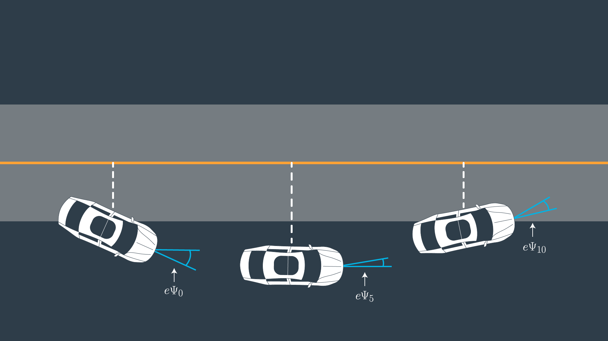

# Model Predictive Control

Model Predictive Control is used in self driving cars to calculate the optimal control commands (throttle and steering) that the vehicle needs to execute in order to follow a reference trajectory.

MPC solves an optimization problem at each time step over a short period of time (*Prediction Horizon*) and determines the immediate next action that minimizes a cost function to follow a desired trajectory while satisfying a set of constraints.

For example, we would like to adjust the throttle and steering that minimizes the difference between our current trajectory and the reference trajectory under the constrain that the vehicle cannot steer more than 25°.

At the current state (at time k), a trajectory as well as the optimal controls are predicted over the *Prediction Horizon* but only the next control is executed.

At the next time step (k+1), the optimization is performed again and new values over the shifted *Prediction Horizon* are predicted.

In the same fashion, a new optimal control value is calculated at every time step.

## Kinematic Vehicle Model

In order to predict the future state of the vehicle, the [Kinematic Vehicle Model](https://borrelli.me.berkeley.edu/pdfpub/IV_KinematicMPC_jason.pdf) is used.

The state of the vehicle is represented by its current position (x, y), orientation, speed, cross track error and orientation error:

The following kinematic equations can be used to predict the vehicle's future state:

### Cross Track Error

We can define the cross track error as the difference between the reference trajectory (yellow line) and the current vehicle position.

Assuming the reference line is represented as a polynomial f(x), we can express the current CTE as:

### Orientation Error

The orientation error can be defined as the desired orientation subtracted from the current orientation:

The current orientation is known and the desired orientation (desired psi) can be calculated as the tangential angle of the polynomial f(x) evaluated at xt, where f(x) represents the reference trajectory and f'(x) is the derivative of the polynomial:

## Cost Function

The cost function that has to be minimized contains multiple terms and consist of a sum of squares over all timesteps N.

#### Reference state

The cost function should try to minimize the reference state, that is, the cross track error and the orientation error:

The error between our current velocity and the desired velocity is also considered:

#### Use of actuators

The actuators are minimized to avoid big values in steering and acceleration:

#### Value gap between sequential actuations

It is also important to minimize the difference of actuations between timesteps to avoid big changes in steering and acceleration (jerk):

Each value in the cost function is weighted with a term that has to be tuned.

## Constraints

The actuators (throttle and steering values) are constrained and have to be considered in the optimization:

## Prediction Horizon

The prediction horizon is the duration over which future predictions are made (`T`).

`T` is the product of `N` (number of timesteps) and `dt` (time between actuations).

`T` should be a few seconds and it should be as large as possible to be able to predict in advance (like when a curve is coming) but not too large because the environment will change as we predict further.

These as hyperparameters that need to be tuned for each model predictive controller.

#### Number of Timesteps

The number of timesteps `N` of the controller will also determine the number of variables that need to be optimized so a high value will imply more computational cost.

#### Timestep duration

MPC controller is approximating a continuous reference trajectory with discrete paths between actuations. A large value of `dt` will not approximate the continuous trajectory very accurately.

Here we can see an example where the blue line is the reference trajectory and the red line the estimated trajectory:

## Latency

In a real self driving car, the actuation commands won't execute instantly. There is a delay between the calculation of the command and the execution of it while it propagates through the system.

This latency can be around 100 ms and it could be difficult to consider by some controllers like the PID controller.

However MPC can model this latency because is calculating predicted values into the future.

This latency could be considered propagating the current state of the vehicle 100 ms (or the duration of the latency) into the future using the vehicle model. Then, we can run the MPC using the propagated value as a starting point in the optimization.
